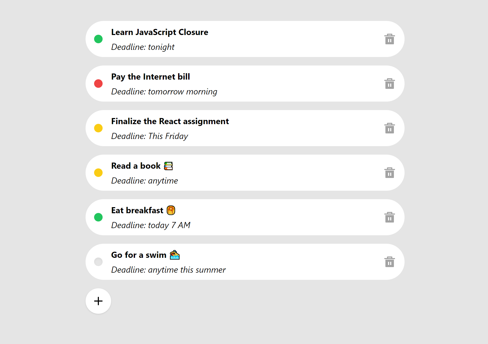

# Todo App - Brima Freeman

A fully functional todo app that does exactly what you want it to.

**live demo: [https://brimatodo.netlify.app/](https://brimatodo.netlify.app/)**

---

### Coded with ❤️ by Brima Freeman

Like my work? Check out more at my website [brimafreeman.netlify.app](https://brimafreeman.netlify.app/)

---

## Project Description

In this project, I create a button which once clicked brings up a modal for adding a new todo item. The project focused around components and their states, as well as their props. To get the best result, a state management system like `Redux Toolkit` got the job done. All animations are done using `Framer Motion`.

> This project is my first with `Redux Toolkit`. Learning a new technology is much easier for me when I get to implement it in something real, like this project. I learnt mostly by reading docs and watching videos. Understanding state management in React is essential, since it enables the development of more complex applications. I'm looking forward to using this techonology in the future!

## What we are going to learn/use

- [React](https://reactjs.org/)
- [Redux Toolkit](https://redux-toolkit.js.org/)
- [Framer Motion](https://framer.com/motion/)
- [React icons](https://react-icons.netlify.com/)
- [React Hot Toast](https://react-hot-toast.com/)
- [Tailwind CSS](https://tailwindcss.com/)


## Getting Started

After getting the necessary files from this repo, go to the file directory and run

```shell
npm install
```

and after that, start the dev server

```shell
npm start
```

## Tools Used

1. Code Editor: [VS Code](https://code.visualstudio.com/)

## Other projects

- [Snap](https://github.com/Graquick/Snap)
- [Blog](https://github.com/Graquick/Blog)
- [Fruit](https://github.com/Graquick/Fruit)

---

## License

&copy; Brima Freeman 2022 All Rights Reserved
